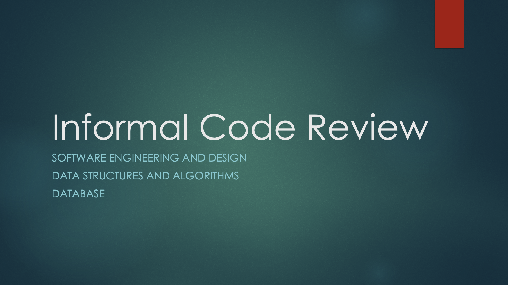

## Professional Self-Assessment

## Informal Code Review
[](https://youtu.be/o1_J0Hd11ak)

## Artifacts
### Software Engineering and Design
For this artifact I have chosen the [Zoo Monitoring Command Line Interface (CLI)](https://github.com/paronicholas/ZooMonitorSystem), a Java based application, which I first developed in the IT 145: Foundations in Application Development course. I chose this application because it provided the best opportunity for improvement within a completed application and offered a change for me to showcase areas of growth with regards to my utilization and understanding of software engineering and design principles. For this portion of improvements, I focused on re-designing the structure of the application to better follow object-oriented design principles and class based structures. The re-design also incorperated my learning of test-driven development and secure coding principles.

One of the major improvements of the application was in the design of the application. Below is the improvement to the overall class structure:

#### Initial Application Structure
```
src/main/java
 |- Main.java
 |- Menus.java
 |- Monitors.java
 |- Parsers.java
 |- animals.txt
 |- habitats.txt
```

#### Re-designed Application Structure
```
src
 |- main/java
  |- helper
   |- MonitorSystemOutputStatic.java
   |- Parse.java
  |- menu
   |- MainMenu.java
   |- Menu.java
   |- MonitorMenu.java
  |- monitor
   |- Animal.java
   |- Habitat.java
  |- system
   |- MainSystem.java
   |- MonitorSystem.java
  |- text
   |- animals.txt
   |- habitats.txt
  |- Main.java
 |- test/java
  |- helper
   |- ParseTest.java
```

### Data Structures and Algorithms
For this artifact I have chosen the [Zoo Monitoring Command Line Interface (CLI)](https://github.com/paronicholas/ZooMonitorSystem), a Java based application, which I first developed in the IT 145: Foundations in Application Development course. I chose this application for the data structures and algorithms improvement for similar reasons to the software engineering and design segment - the Zoo Monitoring CLI offered the best opportunity to showcase my areas of improvement in data structure and algorithmic implementation. For this refactor I mainly focused on the `Parse.java` class. In the initial implementation of this class, the Parse class read was called every time a monitor was chosen. The parsing method - `monitorInfoParser` would loop through a list of strings, retrieved from the specified text file, and then remove everything prior to the expected animal or habitat.
```java
void monitorInfoParser(List<String> parsableList, int choiceNumber, int mainMenuOption) {
        List<String> monitorInfoList = new ArrayList<>(Collections.emptyList());
        int[] monitorInfoLength = new int[2];

        monitorInfoLength[0] = 4;  // Length of animal monitor for iteration
        monitorInfoLength[1] = 3;  // Length of habitat monitor for iteration

        // Assigns call variables to user chosen monitor option
        for (i = 0; i < choiceNumber; ++i) {
            for (j = 0; j <= monitorInfoLength[mainMenuOption - 1]; ++j) {
                monitorInfoList.add(parsableList.get(0));
                parsableList.remove(0);
            }
        }

        // Removes parsed monitor information prior to user chosen monitor option
        for (i = 0; i < choiceNumber - 1; ++i) {
            for (j = 0; j <= monitorInfoLength[mainMenuOption - 1]; ++j) {
                monitorInfoList.remove(0);
            }
        }

        System.out.println("------------------------------");

        // Creates alert for out-of-normal information and removes "*" from index string
        for (i = 0; i <= monitorInfoLength[mainMenuOption - 1]; ++i) {
            if (monitorInfoList.get(i).contains(ALERT_CHARACTERS)) {
                alert = monitorInfoList.get(i).replace(ALERT_CHARACTERS, "");
                monitorInfoList.set(i, alert);  // Replaces index string with "*" with same index string without "*"
                System.out.printf("ALERT - %s - ALERT\n\n", alert.toUpperCase());
            }
        }

        for (i = 0; i <= monitorInfoLength[mainMenuOption - 1]; ++i) {
            System.out.println(monitorInfoList.get(i));
        }
        System.out.println("------------------------------\n");
    }
```
This implementation did not offer any error handling or provide any reliability in the system if a user input the incorrect information into the text file. For the refactor, I extracted out the different portions of this method into helper functions and used the new `Animal` and `Habitat` objects created in the software engineering and design refactor to dynamically build a list of `Animal` or `Habitat` objects to be used for the chosen monitor menu. This refactor allowed me to add in additional error handling, ensure that all `Animal` or `Habitat` objects had the same structures, and improved the overall efficiency by reducing the number of times the text files needed to be parsed while the system was running. The new structure, and stack tracing, can be followed from the [buildAnimalList](https://github.com/paronicholas/ZooMonitorSystem/blob/master/src/main/java/helper/Parse.java#L71) method or the [buildHabitatList](https://github.com/paronicholas/ZooMonitorSystem/blob/master/src/main/java/helper/Parse.java#L97) method.

### Database
For this artifact I chose the [Mobile2App Weight Tracker Android app](https://github.com/paronicholas/WeightTracker), a Android/Java based application, which I first developed in the CS 360: Mobile Architect and Programming course. This application is a simple weight tracking phone app which allows a user to create an account or log in, add a target weight, add daily weight records, and view the logged weights in a logbook. I chose this applications because it was the only major application, which I developed at SNHU, to feature a database and because this application's database needed specific improvements to allow it to function properly. The areas of focus for improvement in this application included:
* [zero-index error](https://github.com/paronicholas/WeightTracker/commit/8bf5a266354926aefa59097875824d28850971b5#diff-c28b91864d35b83e735513feafc343959dfeda79c0e4ae15fffd9d01899a1542L53) when creating a new user account row within the accounts table
* [getAccountByUsername](https://github.com/paronicholas/WeightTracker/blob/master/app/src/main/java/com/example/weighttracker/database/helper/WeightTrackerDatabase.java#L121) method for the accounts table
* [getDailyWeightsByAccountId](https://github.com/paronicholas/WeightTracker/blob/master/app/src/main/java/com/example/weighttracker/database/helper/WeightTrackerDatabase.java#L178) method for the daily weights table
* [getTargetWeightByAccountId](https://github.com/paronicholas/WeightTracker/blob/master/app/src/main/java/com/example/weighttracker/database/helper/WeightTrackerDatabase.java#L239) method for the target weight table

These improvements were necessary to increase the data security of the system and the overall efficiency. The initial implementation relied upon pulling all entries from the database and filtering the results by account id once the data had been retrieved. This left the system vulnerable to users getting access to others information and potentially altering the username, password, or stored weight records. In addition to improving the system's security, the new methods also improve efficiency by only querying the database for the records associated with a single user. This eliminated additional checks within the code to filter out the non-current-user data.
